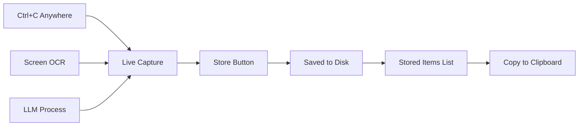

# Clipboard & OCR Manager - Implementation Plan

## Overview
A unified clipboard and OCR manager that captures text from Ctrl+C, screen regions via OCR, and provides LLM processing capabilities. All data is persistently stored with auto-load on startup.

## Core Philosophy
- **Occam's Razor**: Minimal complexity, maximum utility
- **Unix Philosophy**: Do one thing well
- **Linus Torvalds Approach**: Direct, efficient, no bloat

## Main Window Layout

### Window Structure
```
┌────────────────────────────────────────────────────┐
│         📋 Clipboard & OCR Manager                 │
├────────────────────────────────────────────────────┤
│ [▼ Screen OCR]                                     │
├────────────────────────────────────────────────────┤
│ [Collapsible OCR Panel - Hidden by Default]        │
├──────────────────────────┬─────────────────────────┤
│    Live Capture          │    Stored Items        │
│  ● Monitoring Ctrl+C     │  🔍 [Search____]        │
│ ┌──────────────────────┐ │ ┌───────────────────┐  │
│ │                      │ │ │[14:32] 📋 git com..│  │
│ │  All text appears    │ │ │[14:28] 📝 API_KEY│  │
│ │  here first          │ │ │[14:15] 📋 docker..│  │
│ │                      │ │ │[14:03] 📝 Lorem.. │  │
│ └──────────────────────┘ │ └───────────────────┘  │
│                          │                        │
│ [Store →]                │ [📋Copy][🗑️Del][📤Export]│
│ [🤖 Process by LLM][⚙️]  │                        │
└──────────────────────────┴─────────────────────────┘
```

### Expanded OCR Panel
```
┌────────────────────────────────────────────────────┐
│ [▲ Screen OCR]                                     │
├────────────────────────────────────────────────────┤
│ [Image Preview] [📷 Crop] [🤖 Extract to Capture]  │
│ Status: ✓ Ready                                    │
└────────────────────────────────────────────────────┘
```

## Data Flow



## File Structure

```
~/.clipboard_manager/
├── settings.json         # User preferences and LLM prompts
├── index.json           # Metadata for all stored items
└── items/               # Individual text files
    ├── 20241209_143201_123456.txt
    ├── 20241209_143156_789012.txt
    └── ...
```

## Core Components

### 1. Clipboard Monitor
- **Function**: Monitor system clipboard via Ctrl+C
- **Implementation**: `keyboard` library hooks
- **Auto-capture**: Text appears instantly in Live Capture

### 2. Live Capture Panel (Left)
- **Purpose**: Temporary holding area for all incoming text
- **Sources**: 
  - Clipboard (Ctrl+C)
  - OCR extraction
  - LLM responses
- **Actions**:
  - Store → Save to persistent storage
  - Process by LLM → Send to AI for processing
  - Settings → Configure LLM prompt

### 3. Stored Items Panel (Right)
- **Purpose**: Persistent storage with search
- **Features**:
  - Auto-load on startup
  - Search/filter capability
  - Copy back to clipboard
  - Delete individual items
  - Export all items
- **Display**: `[timestamp] icon preview...`
- **Icons**: 📋 for commands, 📝 for text

### 4. Screen OCR Panel (Collapsible)
- **Default**: Hidden to save space
- **Workflow**:
  1. Click "📷 Crop" → Draw rectangle on screen
  2. Image preview appears
  3. Click "🤖 Extract to Capture" → Send to LLM
  4. Text appears in Live Capture
- **Key**: Results always go to Live Capture (unified flow)

### 5. LLM Integration
- **Auto-detect API keys** from environment:
  - `ANTHROPIC_API_KEY` → Claude
  - `OPENAI_API_KEY` → GPT-4
  - `GOOGLE_API_KEY` → Gemini
- **Customizable prompts** with presets:
  - Explain
  - Code analysis
  - Translation
  - Summarization
  - Fix errors

## Technical Implementation

### Required Libraries
```python
# Core
import tkinter as tk
from tkinter import ttk

# Clipboard monitoring
import keyboard  # For Ctrl+C detection
import pyperclip  # For clipboard operations

# Screen capture
from PIL import Image, ImageGrab

# LLM integration
import requests
import base64

# Storage
import json
from pathlib import Path
from datetime import datetime
```

### Key Classes

```python
class ClipboardManager:
    def __init__(self):
        self.storage_dir = Path.home() / ".clipboard_manager"
        self.setup_storage()
        self.load_settings()
        self.load_items()
        self.setup_ui()
        self.start_monitoring()
    
    def setup_storage(self):
        """Create storage directories"""
        
    def start_monitoring(self):
        """Start Ctrl+C monitoring"""
        
    def store_item(self, text):
        """Save to persistent storage"""
        
    def load_items(self):
        """Load stored items on startup"""
        
    def process_by_llm(self, text):
        """Send text to LLM for processing"""
        
    def crop_screen(self):
        """Interactive screen region selection"""
        
    def extract_ocr(self, image):
        """Send image to LLM for text extraction"""
```

### Storage Format

#### index.json
```json
[
  {
    "id": "20241209_143201_123456",
    "timestamp": "2024-12-09T14:32:01",
    "text": "git commit -m \"fix\"",  // First 100 chars
    "type": "cmd",
    "length": 20,
    "source": "clipboard"
  }
]
```

#### settings.json
```json
{
  "llm_prompt": "Explain this text clearly:\n{text}",
  "window_geometry": "800x500",
  "ocr_expanded": false,
  "max_items": 1000,
  "cleanup_days": 30
}
```

## User Workflows

### Workflow 1: Clipboard Collection
1. User copies text anywhere (Ctrl+C)
2. Text appears in Live Capture
3. Click "Store" to save permanently
4. Item appears in Stored Items with timestamp

### Workflow 2: Screen OCR
1. Click "▼ Screen OCR" to expand panel
2. Click "📷 Crop" 
3. Draw rectangle on screen
4. Click "🤖 Extract to Capture"
5. Extracted text appears in Live Capture
6. Store if needed

### Workflow 3: LLM Processing
1. Text in Live Capture
2. Click "🤖 Process by LLM"
3. Result replaces text in Live Capture
4. Store processed text if needed

### Workflow 4: Retrieve Stored Item
1. Search or scroll in Stored Items
2. Select item
3. Click "📋 Copy" 
4. Text copied to system clipboard

## Optimizations

### Performance
- **Lazy loading**: Load only metadata on startup, full text on demand
- **Index file**: Fast search without reading all files
- **Auto-cleanup**: Remove items older than 30 days

### User Experience
- **Single window**: No popups or dialogs (except settings)
- **Unified capture area**: All text flows through same place
- **Auto-save**: No manual save needed
- **Persistent state**: Window position, panel state saved

### Code Quality
- **No redundancy**: Single capture flow for all sources
- **Clear separation**: Temporary (left) vs Permanent (right)
- **Minimal dependencies**: Use standard libraries where possible
- **Error resilience**: Graceful handling of missing APIs

## Future Enhancements (NOT for v1)
- ❌ Categories/tags
- ❌ Cloud sync
- ❌ Multiple windows
- ❌ Advanced formatting
- ❌ Database storage

## Success Metrics
- **Startup time**: < 1 second with 1000 items
- **Capture latency**: < 100ms from Ctrl+C
- **OCR extraction**: < 3 seconds
- **Memory usage**: < 50MB for 1000 items
- **Code size**: < 1000 lines total

## Implementation Priority
1. ✅ Core clipboard monitoring
2. ✅ Persistent storage system
3. ✅ Basic UI with two panels
4. ✅ Screen OCR with LLM
5. ✅ LLM text processing
6. ✅ Search functionality

## Key Decisions
- **No tabs**: Everything in one view
- **No categories**: Just chronological + search
- **No database**: Simple JSON + text files
- **No local OCR**: Always use LLM for accuracy
- **Auto-detect type**: Commands vs text based on content

## Testing Checklist
- [ ] Ctrl+C captures text instantly
- [ ] Items persist after restart
- [ ] OCR extracts text accurately
- [ ] LLM processing works with all providers
- [ ] Search finds text in stored items
- [ ] Export creates readable backup
- [ ] Cleanup removes old items
- [ ] Settings persist between sessions

## Final Notes
Keep it simple. Every feature must justify its existence. If users don't immediately understand it, remove it. The best interface is invisible - it just works.