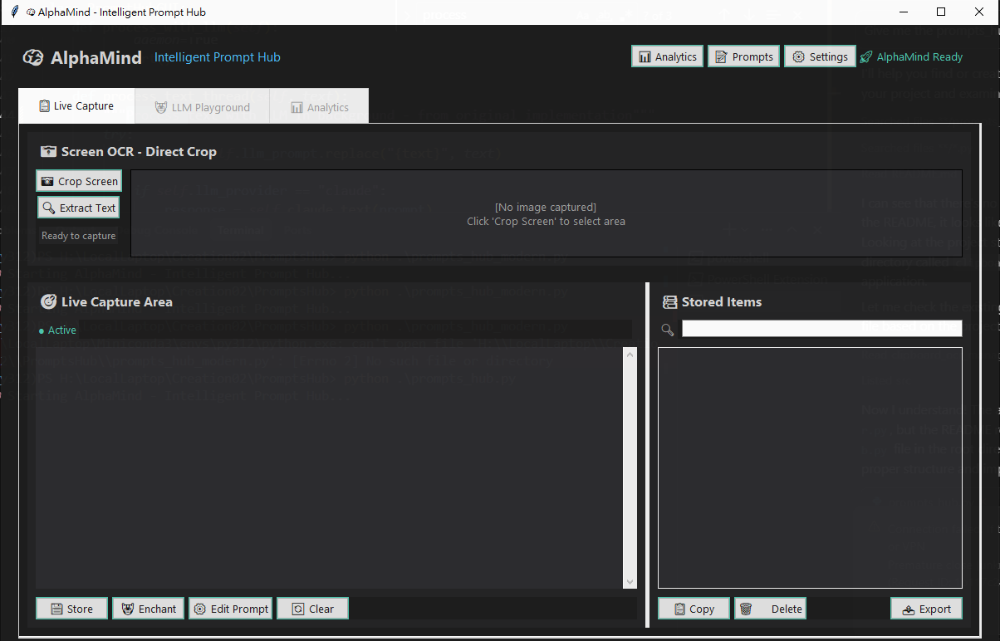

[](https://buymeacoffee.com/yuchenghuang)

# 📋 PromptHub

> **Codename**: AlphaMind | **Vision**: Alicization  

A clean, minimal tool for clipboard monitoring, screen OCR, and LLM text processing with Windows screen capture protection.



## 🧠 The AlphaMind Philosophy

**Alicization** - Our core principle of creating AI that transcends simple command execution to achieve true human-AI symbiosis. Like the concept from Sword Art Online, we're building technology that doesn't just respond to commands, but develops genuine understanding of human intent and adapts to serve human creativity and productivity.

**AlphaMind Engine** powers this vision through:
- 🎯 **Intent Recognition**: Understanding what you want to achieve, not just what you typed
- 🔄 **Adaptive Learning**: Growing smarter with every interaction
- 🤝 **Human Symbiosis**: Becoming a natural extension of your thought process
- ⚡ **Predictive Assistance**: Anticipating needs before you express them

### 🧞 **PromptGenie Integration**

**PromptGenie** is our intelligent prompt management system that brings magical efficiency to your AI interactions:

- 🪄 **Smart Prompt Templates**: Pre-built patterns for common tasks (summarization, analysis, translation, etc.)
- 🔮 **Dynamic Prompt Generation**: AI-powered prompt creation based on your content and intent
- 📚 **Prompt Library**: Curated collection of proven prompts for various domains
- 🎯 **Context-Aware Suggestions**: Recommends optimal prompts based on your current text
- 💫 **One-Click Magic**: Transform any text with intelligent prompt application

## Features

### 🎯 **Core Functionality**
- **Clipboard Monitoring**: Automatically captures Ctrl+C clipboard content
- **Screen OCR**: Select and extract text from any part of your screen
- **Persistent Storage**: Store and organize captured text items
- **LLM Integration**: Process text with Claude, OpenAI GPT, or Google Gemini
- **Windows Protection**: Built-in screen capture protection (Windows-only)

### 🔧 **Key Features**
- **Always on Top**: Window stays visible above other applications
- **Smart Detection**: Automatically detects text type (command, URL, etc.)
- **Search & Filter**: Find stored items quickly with search functionality
- **Export Options**: Export all items to formatted text files
- **Copy/Delete Operations**: Manage stored items with intuitive controls

## Installation

### Prerequisites
```bash
# Core dependencies
pip install tkinter pillow requests pyperclip keyboard

# Optional: For enhanced functionality
pip install python-dotenv
```

### Setup
1. Clone or download the repository
2. Copy `.env.template` to `.env` (optional)
3. Add your API keys to `.env`:
```env
ANTHROPIC_API_KEY=your_claude_api_key
OPENAI_API_KEY=your_openai_api_key  
GEMINI_API_KEY=your_gemini_api_key
```

``` windows powershell env
$env:ANTHROPIC_API_KEY=your_claude_api_key
$env:OPENAI_API_KEY=your_openai_api_key  
$env:GEMINI_API_KEY=your_gemini_api_key
```

## Usage

### Starting the Application
```bash
python prompts_hub.py
```

### Basic Operations

#### 📋 **Clipboard Monitoring**
- **Auto-start**: Monitoring begins automatically
- **Manual capture**: Copy anything with Ctrl+C
- **Status indicator**: Green "● Monitoring Ctrl+C" when active

#### 📸 **Screen OCR**  
1. Click "▼ Screen OCR" to expand panel
2. Click "📷 Capture Screen" 
3. Select area with mouse drag
4. Text appears automatically in capture area
5. Click "🔍 Extract Text" to process with OCR

#### 💾 **Storage Management**
- **Store**: Click "💾 Store" to save current text (text remains in capture area)
- **Copy**: Double-click item or use "📋 Copy" button
- **Delete**: Select item and click "🗑️ Delete" 
- **Export**: Click "📤 Export" to save all items to file

#### 🤖 **LLM Processing**
1. Enter custom prompt or use default
2. Select provider (Claude/OpenAI/Gemini)
3. Click "🚀 Process with LLM"
4. Processed text appears in capture area

### Storage Structure
```
~/.clipboard_manager/
├── items/           # Individual text files
├── index.json       # Items metadata  
├── settings.json    # User preferences
└── export_*.txt     # Export files
```

## API Configuration

### Supported Providers
- **Claude (Anthropic)**: `ANTHROPIC_API_KEY`
- **OpenAI GPT**: `OPENAI_API_KEY`
- **Google Gemini**: `GEMINI_API_KEY`

### Environment Variables
The application will work without API keys but LLM processing will be unavailable.

## Windows Screen Capture Protection

When running on Windows, the application automatically applies screen capture protection to prevent the window from appearing in screenshots or screen recordings.

**Features:**
- Automatic detection and application on Windows
- Error reporting if protection fails  
- No impact on Linux/macOS functionality

## File Types & Detection

The application automatically detects and categorizes text:
- **Commands**: Shell commands, scripts
- **URLs**: Web addresses, file paths
- **Code**: Programming code snippets
- **Text**: Regular text content

## Troubleshooting

### Common Issues

#### Missing Dependencies
```bash
# Install missing packages
pip install pillow pyperclip keyboard requests
```

#### OCR Not Working
- Ensure PIL (Pillow) is installed
- Check screen selection area (minimum size required)
- Verify mouse drag selection

#### LLM Processing Fails
- Check API keys in `.env` file
- Verify internet connection
- Check API provider status

#### Screen Capture Protection Errors
- Normal on non-Windows systems
- May fail on older Windows versions
- Does not affect core functionality

### Storage Issues
- Storage location: `~/.clipboard_manager/`
- Permissions: Ensure write access to home directory
- Corruption: Delete `index.json` to rebuild

## Dependencies

### Required
- **tkinter**: GUI framework (usually included with Python)
- **PIL/Pillow**: Image processing for OCR
- **requests**: HTTP requests for LLM APIs

### Optional  
- **pyperclip**: System clipboard access
- **keyboard**: Global hotkey support
- **python-dotenv**: Environment file loading

### Windows-Only
- **ctypes**: Screen capture protection (built-in)

## Development

### Project Structure
- `prompts_hub.py`: Main application
- `src/lib/env_utils/`: Environment utilities
- `.env.template`: Environment configuration template

### Contributing
1. Fork the repository
2. Create feature branch
3. Test on Windows and Linux
4. Submit pull request

## License

MIT License - See LICENSE file for details

## Version History

- **v1.0**: Initial release with core features
- **Latest**: Enhanced UI, screen capture protection, LLM integration

---

*For issues or feature requests, please create an issue in the repository.*