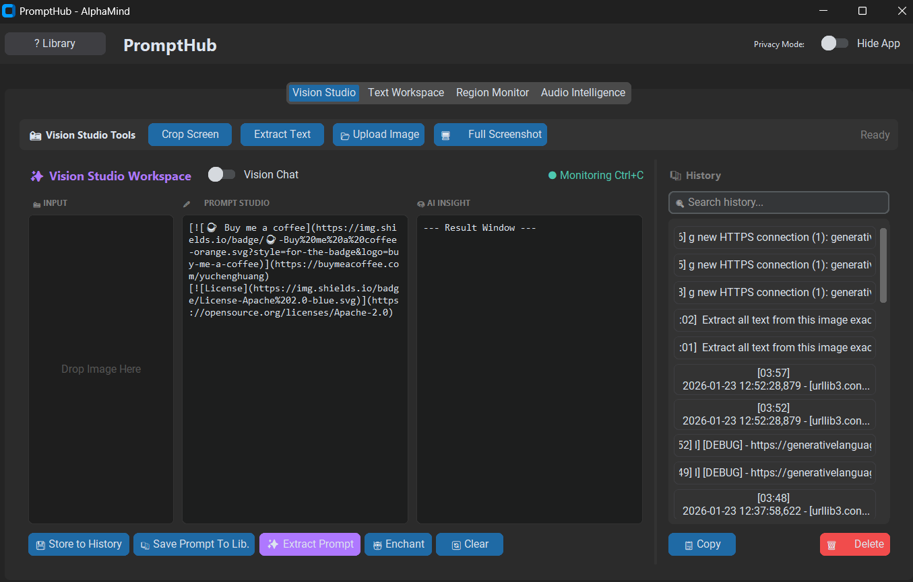

[](https://buymeacoffee.com/yuchenghuang)
[](https://opensource.org/licenses/Apache-2.0)


#  PromptsHub: AlphaMind Edition (v3.3.4)

> **Codename**: AlphaMind Studio | **Vision**: Alicization | **Status**: Active Symbiosis

PromptsHub is a high-performance workspace for AI-human collaboration. It transforms your desktop into an intelligent environment that captures, processes, and reverse-engineers text and vision in real-time.


*The AlphaMind V3.3.4 Studio Interface featuring the multi-pane development environment.*

---

##  Key Capabilities

###  Live Capture & Vision
- **Smart Clipboard**: Automatically captures text copies for instant AI refinement.
- **Side-by-Side Editor**: Real-time comparison view showing original input vs. AI-processed output.
- **Screen OCR**: Extract text from any screen area using Gemini Vision APIs.
- **Vision Chat**: Upload images or screenshots and ask the AI complex questions about them.
- **Monitor Studio (New)**: 
  - **3-Column Layout**: Dedicated panes for Activity Logs, Live Preview, and AI Intelligence.
  - **Persistent Region**: Remembers your selection; drag to update instantly.
  - **Floating View**: Detach the monitor into an always-on-top window for multitasking.
  - **Smart Rate Limiting**: Adjustable polling slider (2s-30s) and auto-pause on API limits (429).
  - **Translation & Insights**: Extract raw text or automatically translate/analyze changes.
- **Privacy Mode (Default-ON)**: Prevents the application window from being captured in its own screenshots/recordings.

###  Intelligence Suite
- **Multi-Provider Support**: Seamless switching between **Gemini 2.5 Flash**, **GPT-4**, and **Claude 3**.
- ** Extract Prompt**: Reverse-engineer any text output into a reusable prompt template with `["Input"]` placeholders.
- **"Enchant"**: Instantly polish, professionalize, or transform text using pre-built AI templates.
- **Audio Studio**: 
  - Real-time system audio transcription directly into your workspace.
  - **Live Visualizer**: FFT-based spectral display for audio activity.
  - **Multi-Language Support**: Transcribe in different languages on the fly.

###  Prompt Library & Management
- **Foldable Sidebar**: Always-accessible prompt library for side-by-side editing and template application.
- **Dynamic Categories**: Organize your prompts with icons and custom groups.
- **Smart History**: Persistent storage of every capture with searchable snippets.

---

##  Getting Started

### Prerequisites
```bash
# Core dependencies
python -m pip install customtkinter pillow requests pyperclip python-dotenv sounddevice numpy SpeechRecognition
```

### Configuration
1. Clone the repository.
2. Copy `.env.template` to `.env.local`.
3. Add your API keys:
   ```env
   GOOGLE_API_KEY=AIza...
   OPENAI_API_KEY=sk-...
   ANTHROPIC_API_KEY=sk-ant-...
   ```

### Usage
Run with Administrator privileges (recommended for global hotkeys and monitoring):
```powershell
python prompts_hub.py
```

---

##  Privacy & Security
- **Privacy Mode is enabled by default** on Windows. This uses `WDA_EXCLUDEFROMCAPTURE` to ensure your PromptsHub workspace stays private during screen shares or OCR captures.
- **Local Database**: All library and history data is stored locally in `prompts_hub.db`.

---

##  License & Acknowledgments

Apache License 2.0 - See [LICENSE](file:///c:/Users/User/Downloads/workspace/PromptsHub/LICENSE) and [NOTICE](file:///c:/Users/User/Downloads/workspace/PromptsHub/NOTICE) for details.

Developed with by Yu-Cheng Huang.
